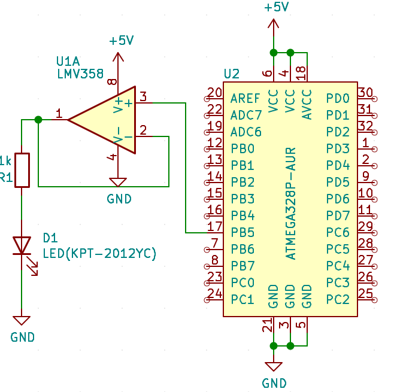

# Lab 1: Gregor Karetka

Link to my `Digital-electronics-2` GitHub repository:

   [https://github.com/gkaretka/Digital-electronics-2](https://github.com/gkaretka/Digital-electronics-2)


### Blink example

1. What is the meaning of the following binary operators in C?
   * `|` - bitwise OR (logicky sucet)
   * `&` - bitwise AND (logicky sucin)
   * `^` - bitwise XOR (logicky xor)
   * `~` - bitwise NOT (logicka negacia)
   * `<<` - bit shift to the left (bitovy posun dolava)
   * `>>` - bit shift to the right (bitovy posun doprava)

2. Complete truth table with operators: `|`, `&`, `^`, `~`

    | **b** | **a** |**b or a** | **b and a** | **b xor a** | **not b** |
    | :-: | :-: | :-: | :-: | :-: | :-: |
    | 0 | 0 | 0 | 0 | 0 | 1 |
    | 0 | 1 | 1 | 0 | 1 | 1 |
    | 1 | 0 | 1 | 0 | 1 | 0 |
    | 1 | 1 | 1 | 1 | 0 | 0 |


### Morse code

1. Listing of C code with syntax highlighting which repeats one "dot" and one "comma" on a LED:

```c
int main(void)
{
    // Set pin as output in Data Direction Register
    // DDRB = DDRB or 0010 0000
    DDRB |= (1<<LED_GREEN);

    // Set pin LOW in Data Register (LED off)
    // PORTB = PORTB and 1101 1111
    PORTB &= ~(1<<LED_GREEN);
    
    // Infinite loop
    while (1)
    {
        send_dot();
        send_comma();
    }

    // Will never reach this
    return 0;
}

/*
 * Low level send comma by manipulating pin and delaying
 */
void send_comma(void)
{
    PORTB |= (1 << LED_GREEN);
    _delay_ms(COMMA_DELAY);
    
    PORTB &= ~(1 << LED_GREEN);
    _delay_ms(ONE_SPACE);
}

/*
 * Low level send dot by manipulating pin and delaying
 */
void send_dot(void)
{
    PORTB |= (1 << LED_GREEN);
    _delay_ms(DOT_DELAY);
    
    PORTB &= ~(1 << LED_GREEN);
    _delay_ms(ONE_SPACE);
}
```

2. Code for displaying "DE2" in morse code

```C
// Morse code array A-Z
char *morse_alphabet[26] = {
    ".-", "-...", "-.-.", "-..", ".", "..-.", "--.", "....", "..", ".---", "-.-", ".-..", "--",
    "-.", "---", ".--.", "--.-", ".-.", "...", "-", "..-", "...-", ".--", "-..-", "-.--", "--.."
};

// Morse code array 0 - 9
char *morse_numbers[10] = {
    "-----", ".----", "..---", "...--", "....-", ".....", "-....", "--...", "---..", "----."
};

#define ONE_SPACE		500

#define DOT '.'
#define DOT_DELAY		ONE_SPACE

#define COMMA '-'
#define COMMA_DELAY	    (ONE_SPACE*3)

#define SPACE '/'
#define SPACE_DELAY	    (ONE_SPACE*3)

void dispaly_message_morse_code(char *msg);
void display_char_in_morse_code(char c);
void ll_display_char_in_morse_code(char *c);

void send_space(void);
void send_comma(void);
void send_dot(void);

int main(void)
{
    // Set pin as output in Data Direction Register
    // DDRB = DDRB or 0010 0000
    DDRB |= (1<<LED_GREEN);

    // Set pin LOW in Data Register (LED off)
    // PORTB = PORTB and 1101 1111
    PORTB &= ~(1<<LED_GREEN);
    
    // Infinite loop
    while (1)
    {
        /* Char '/' is used for sending additional spaces
         * You can try any combination
         * Tested with: 
         * BPC/DE2/
         * DE2/
         * de2/
         */
        
        char *msg = "DE2/";
        dispaly_message_morse_code(msg);
    }

    // Will never reach this
    return 0;
}

/*
 * Takes *char(string) as input and separates it into individual characters.
 */
void dispaly_message_morse_code(char *msg)
{
    char *msg_ptr = msg;
    while(*msg_ptr != '\0') {
        if (*msg_ptr == '/') {
            send_space(); 
        } else {
            display_char_in_morse_code(*msg_ptr);
            send_space(); 
        }                
        msg_ptr++;
    }
}

/*
 * Look-up table for characters in Morse code alphabet/numbers. 
 */
void display_char_in_morse_code(char c)
{
    if (c >= 65 && c <= 95) { // if char is ASCII A-Z
        ll_display_char_in_morse_code(morse_alphabet[(uint8_t)c - 65]);
    } else if (c >= 97 && c <= 122) { // if char is ASCII a-z
        ll_display_char_in_morse_code(morse_alphabet[(uint8_t)c - 97]);
    } else if (c >= 48 && c <= 57) { // if char is ASCII 0-9
        ll_display_char_in_morse_code(morse_numbers[(uint8_t)c - 48]);
    }
}

/*
 * Low level function for Morse code display, check one by one char and 
 * performs action accordingly by sending COMMA or DOT
 */
void ll_display_char_in_morse_code(char *char_codes)
{
    char *msg_ptr = char_codes;
    while(*msg_ptr != '\0') {
        if (*msg_ptr == COMMA) send_comma();
        else if (*msg_ptr == DOT) send_dot();

        msg_ptr++;
    }        
}

/*
 * Low level send space by manipulating pin and delaying
 */
void send_space(void)
{
    PORTB &= ~(1 << LED_GREEN);
    _delay_ms(SPACE_DELAY);
}

/*
 * Low level send comma by manipulating pin and delaying
 */
void send_comma(void)
{
    PORTB |= (1 << LED_GREEN);
    _delay_ms(COMMA_DELAY);
    
    PORTB &= ~(1 << LED_GREEN);
    _delay_ms(ONE_SPACE);
}

/*
 * Low level send dot by manipulating pin and delaying
 */
void send_dot(void)
{
    PORTB |= (1 << LED_GREEN);
    _delay_ms(DOT_DELAY);
    
    PORTB &= ~(1 << LED_GREEN);
    _delay_ms(ONE_SPACE);
}
```


3. Scheme of Morse code application, i.e. connection of AVR device, LED, resistor, and supply voltage. The image can be drawn on a computer or by hand. Always name all components and their values!

   
