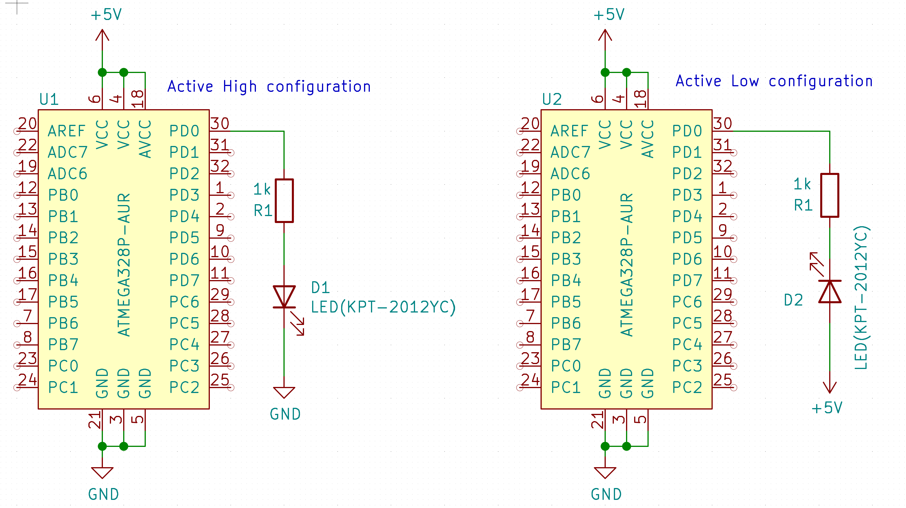
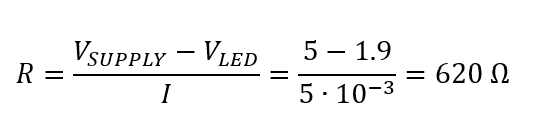
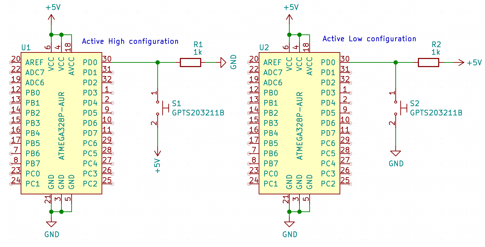
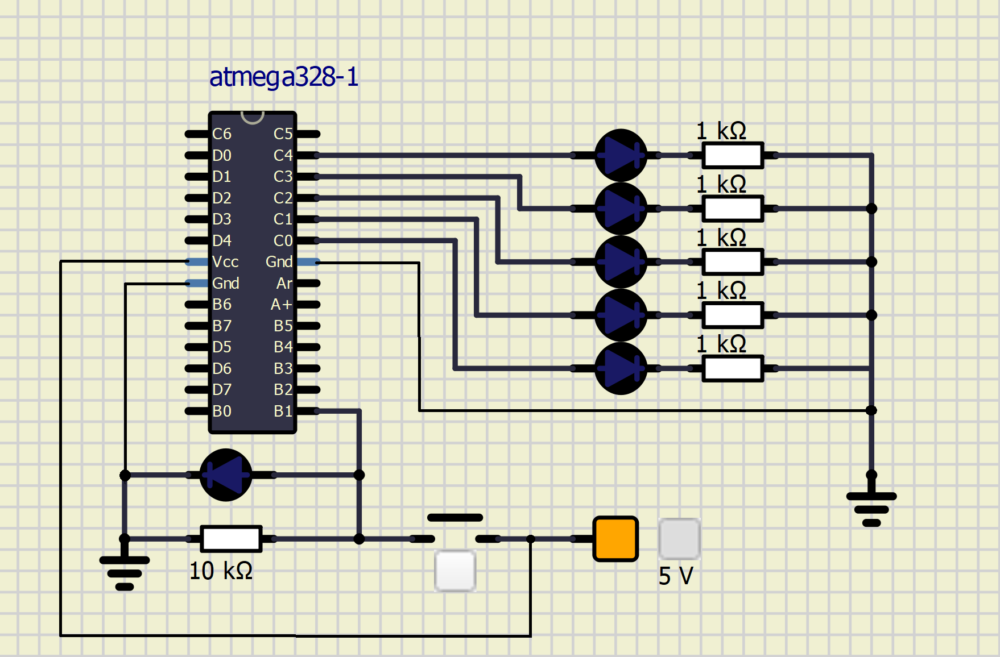

# Lab 2: Gregor Karetka

Link to your `Digital-electronics-2` GitHub repository:

   [https://github.com/gkaretka/Digital-electronics-2](https://github.com/gkaretka/Digital-electronics-2)


### Active-low and active-high LEDs

#### Preparation tasks (schematic)



#### Preparation task calculations



#### Preparation task button connection (schematic)



1. Complete tables according to the AVR manual.

| **DDRB** | **Description** |
| :-: | :-- |
| 0 | Input pin |
| 1 | Output pin |

| **PORTB** | **Description** |
| :-: | :-- |
| 0 | Output low value |
| 1 | Output high value |

| **DDRB** | **PORTB** | **Direction** | **Internal pull-up resistor** | **Description** |
| :-: | :-: | :-: | :-: | :-- |
| 0 | 0 | input | no | Tri-state, high-impedance |
| 0 | 1 | input | yes | Pxn will source current if ext. pulled low |
| 1 | 0 | output | no | Output low (sink) |
| 1 | 1 | output | no | Output high (source) |

2. See [schematic of Arduino Uno board](../../Docs/arduino_shield.pdf) in docs folder of Digital-electronics-2 repository and find out which pins of ATmega328P can be used as input/output pins. To which pin is the LED L connected? Is it connected as active-low or active-high? Note that labels on Arduino `~3`, `~5`, etc. do not mean that the signals are inverted; the `~` symbol indicates that a PWM (Pulse-width modulation) signal can be generated on these pins.

| **Port** | **Pin** | **Input/output usage?** |
| :-: | :-: | :-- |
| A | x | Microcontroller ATmega328P does not contain port A |
| B | 0 | Yes Arduino pin D8 |
|   | 1 | Yes Arduino pin D9 |
|   | 2 | Yes Arduino pin D10 |
|   | 3 | Yes Arduino pin D11 |
|   | 4 | Yes Arduino pin D12 |
|   | 5 | Yes Arduino pin D13 |
|   | 6 | No |
|   | 7 | No |
| C | 0 | Yes Arduino pin A0(D14) |
|   | 1 | Yes Arduino pin A1(D15) |
|   | 2 | Yes Arduino pin A2(D16) |
|   | 3 | Yes Arduino pin A3(D17) |
|   | 4 | Yes Arduino pin A4(D18)|
|   | 5 | Yes Arduino pin A5(D19) |
|   | 6 | Yes/Reset |
|   | 7 | No |
| D | 0 | Yes (Arduino pin RX<-D0) |
|   | 1 | Yes (Arduino pin TX<-D1) |
|   | 2 | Yes Arduino pin D2 |
|   | 3 | Yes Arduino pin D3 |
|   | 4 | Yes Arduino pin D4 |
|   | 5 | Yes Arduino pin D5 |
|   | 6 | Yes Arduino pin D6 |
|   | 7 | Yes Arduino pin D7 |

3. Part of the C code listing with syntax highlighting, which blinks alternately with a pair of LEDs; let one LED is connected to port B and the other to port C:

```c
int main(void)
{
	// Set both LEDs pins to output
    DDRC |= 1 << LED_RED; // output
    DDRB |= 1 << LED_GREEN; // output
    
    // Reset one, set second
    PORTC &= ~(1 << LED_RED); // out 0
    PORTB |= (1 << LED_GREEN); // out 1
    
    // Infinite loop
    while (1)
    {		
            // delay, toggle both LEDs
            _delay_ms(BLINK_DELAY);
            PORTC ^= (1 << LED_RED);
            PORTB ^= (1 << LED_GREEN);    
        }
    }

    // Will never reach this
    return 0;
}
```


### Push button

1. Part of the C code listing with syntax highlighting, which toggles LEDs only if push button is pressed. Otherwise, the value of the LEDs does not change. Let the push button is connected to port D:

```c
int main(void)
{
    DDRC |= 1 << LED_RED; // output
    DDRB |= 1 << LED_GREEN; // output
    DDRD &= ~(1 << BUTTON); // input
    
    // Reset
    PORTC &= ~(1 << LED_RED); // out 0
    PORTB |= (1 << LED_GREEN); // out 1
    PORTD |= (1 << BUTTON); // pullup
    
    // Infinite loop
    while (1)
    {
        if (((PIND >> BUTTON) & 1) == 0) {
            _delay_ms(BLINK_DELAY);
            PORTC ^= (1 << LED_RED);
            PORTB ^= (1 << LED_GREEN);    
        }
    }

    // Will never reach this
    return 0;
}
```

### Knight rider with PWM and INVERSION (whole code in Digital-electronics-2/Labs/02-leds/led_2/led_2/main.c)

```c
int main(void)
{
    LED_DDR |= ((1 << LED4) | (1 << LED3)  | (1 << LED2) | (1 << LED1) | (1 << LED0)); // led outputs
    BUTTON_DDR &= ~(1 << BUTTON); // buttons
    
    uint8_t register_storage = 0;
    uint8_t sample_data = 0;
    uint8_t start = 0;
    uint8_t perform = 0;
    
    // Infinite loop
    while (1)
    {
        // shift register sampler, edge detector
        _delay_ms(50);
        sample_data = (sample_data << 1) | ((((BUTTON_PIN >> BUTTON) & 1) == BTN_INVERTED));
        
        if ((sample_data & 0xF) == 0x0F) start = (start << 1) | 1; // debounce
        else if ((sample_data & 0b0000) == 0b000) start = start << 1;
        
        if (start == 0b0011) perform = 1; // edge detection
        
        if (perform == 1) {
            for (uint8_t i = 0; i < 5; i++) {
                register_storage = 1 << i;
                if (PWM_EN) {
                    // UP
                    for (uint8_t j = 0; j < 255; j++) {
                        LED_PORT = INVERT(LED_PORT | register_storage);
                        for (uint8_t k = 0; k < j/10; k++) _delay_us(10);
                        LED_PORT = INVERT(LED_PORT & ~(register_storage));
                        for (uint8_t k = 0; k < (255-j/10); k++) _delay_us(10);
                    }
                    
                    // DOWN
                    for (uint8_t j = 255; j > 0; j--) {
                        LED_PORT = INVERT(LED_PORT | register_storage);
                        for (uint8_t k = 0; k < j/10; k++) _delay_us(10);
                        LED_PORT = INVERT(LED_PORT & ~(register_storage));
                        for (uint8_t k = 0; k < (255-j/10); k++) _delay_us(10);
                    }
                } else {
                    LED_PORT = INVERT(register_storage);
                    _delay_ms(500);
                }                
            }
                            
            for (uint8_t i = 0; i < 5; i++) {
                register_storage = 1 << (4-i);
                if (PWM_EN) {
                    // UP
                    for (uint8_t j = 0; j < 255; j++) {
                        LED_PORT = INVERT(LED_PORT | register_storage);
                        for (uint8_t k = 0; k < j/10; k++) _delay_us(10);
                        LED_PORT = INVERT(LED_PORT & ~(register_storage));
                        for (uint8_t k = 0; k < (255-j/12); k++) _delay_us(10);
                    }
                    
                    // DOWN
                    for (uint8_t j = 255; j > 0; j--) {
                        LED_PORT = INVERT(LED_PORT | register_storage);
                        for (uint8_t k = 0; k < j/10; k++) _delay_us(10);
                        LED_PORT = INVERT(LED_PORT & ~(register_storage));
                        for (uint8_t k = 0; k < (255-j/10); k++) _delay_us(10);
                    }
                } else {
                    LED_PORT = INVERT(register_storage);
                    _delay_ms(500);
                }
            }
                            
            LED_PORT = INVERT((LED_PORT & ~((1 << LED4) | (1 << LED3)  | (1 << LED2) | (1 << LED1) | (1 << LED0)))); // disable all
            perform = 0; // hold edge detector
            start = 0b10; // ...
        }
    }

    // Will never reach this
    return 0;
}
```


### Knight Rider

1. Scheme of Knight Rider application, i.e. connection of AVR device, five LEDs, resistors, one push button, and supply voltage. The image can be drawn on a computer or by hand. Always name all components and their values!


   
### Simulation 

1. Without PWM

[](http://www.youtube.com/watch?v=AWYQtBLKQeA "Simulation")

### With PWM. 

PWM duty cycle affect brightness of LED because this changes average voltage accross LED thus changing current through LED directly affecting luminosity.

[](http://www.youtube.com/watch?v=2FubTD8N8TU "Simulation")
