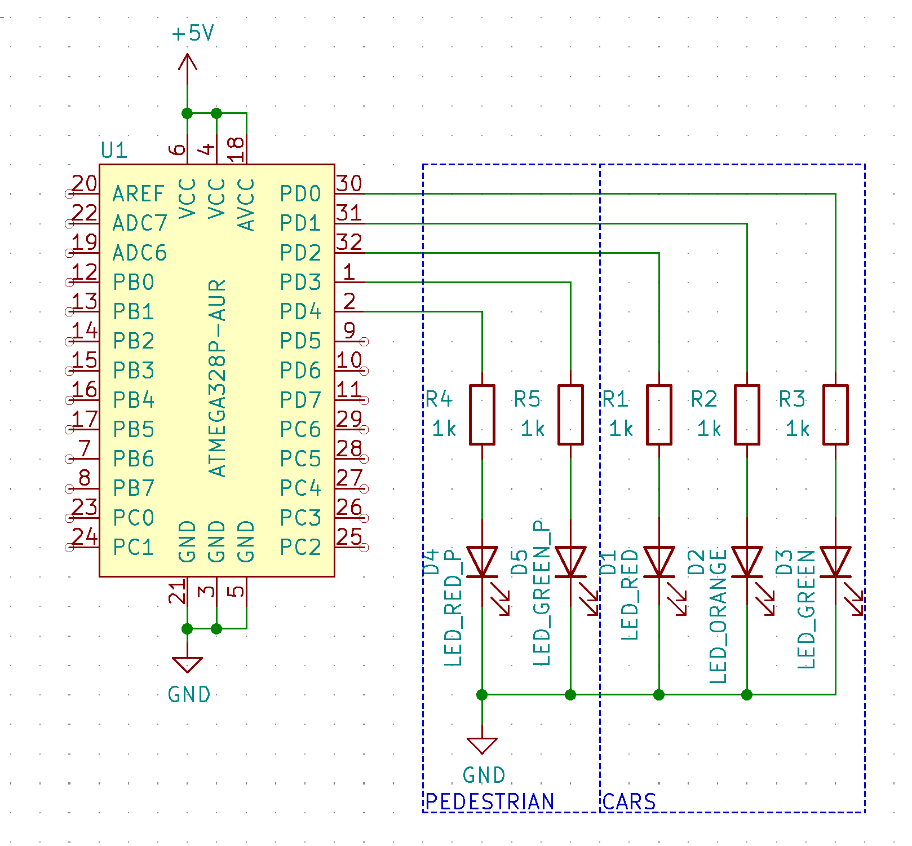

# Lab 3: Gregor Karetka

Link to your `Digital-electronics-2` GitHub repository:

   [https://github.com/gkaretka/Digital-electronics-2](https://github.com/gkaretka/Digital-electronics-2)


### Data types in C

## Preparation tasks (done before the lab at home)

1. Fill in the following table and enter the number of bits and numeric range for the selected data types defined by C.

| **Data type** | **Number of bits** | **Range** | **Description** |
| :-: | :-: | :-: | :-- | 
| `uint8_t`  | 8 | 0, 1, ..., 255 | Unsigned 8-bit integer |
| `int8_t`   | 8 | -128, -127 ... 127 | Signed 8-bit Integer |
| `uint16_t` | 16 | 0, 1, ..., 65535 | Unsigned 16-bit integer |
| `int16_t`  | 16 | −32768, −32767, ... 32767 | Signed 16-bit integer |
| `float`    | 32 | -3.4e+38, ..., 3.4e+38 | Single-precision floating-point |
| `void`     | 0 | 0 | No return type for function / generic pointer |

2. Any function in C contains a declaration (function prototype), a definition (block of code, body of the function); each declared function can be executed (called). Study [this article](https://www.programiz.com/c-programming/c-user-defined-functions) and complete the missing sections in the following user defined function declaration, definition, and call.

```C
#include <avr/io.h>

// Function declaration (prototype)
uint16_t calculate(uint8_t, uint8_t);

int main(void)
{
    uint8_t a = 156;
    uint8_t b = 14;
    uint16_t c;

    // Function call
    c = calculate (a, b);

    while (1)
    {
    }
    return 0;
}

// Function definition (body)
uint16_t calculate(uint8_t x, uint8_t y)
{
    uint16_t result;    // result = x^2 + 2xy + y^2

    result = x*x;
	result += 2*x*y;
	result += y*y;
	
    return result;
}
```

### GPIO library

1. In your words, describe the difference between the declaration and the definition of the function in C.
   * Function declaration - function prototype used to tell compiler that function like this is going to exist with these parameters
   * Function definition - actual code of function that is going to be run

2. Part of the C code listing with syntax highlighting, which toggles LEDs only if push button is pressed. Otherwise, the value of the LEDs does not change. Use function from your GPIO library. Let the push button is connected to port D:

```c
/* Includes ----------------------------------------------------------*/
#include <util/delay.h>     // Functions for busy-wait delay loops
#include <avr/io.h>         // AVR device-specific IO definitions
#include "gpio.h"           // GPIO library for AVR-GCC

/* Function definitions ----------------------------------------------*/
/**********************************************************************
 * Function: Main function where the program execution begins
 * Purpose:  Toggle two LEDs when a push button is pressed. Functions 
 *           from user-defined GPIO library is used.
 * Returns:  none
 **********************************************************************/
int main(void)
{
    // Green LED at port B
    GPIO_config_output(&DDRB, LED_GREEN);
    GPIO_write_low(&PORTB, LED_GREEN);

    // Configure the second LED at port C
    GPIO_config_output(&DDRC, LED_RED);
    GPIO_write_high(&PORTC, LED_RED);

    // Configure Push button at port D and enable internal pull-up resistor
    GPIO_config_input_pullup(&DDRD, BUTTON);

    // Infinite loop
    while (1)
    {
        // Pause several milliseconds
        if (GPIO_read(&PIND, BUTTON) == 0) {
            _delay_ms(BLINK_DELAY);
            PORTC ^= (1 << LED_RED);
            PORTB ^= (1 << LED_GREEN);
        }
    }

    // Will never reach this
    return 0;
}
```


### Traffic light

1. Scheme of traffic light application with one red/yellow/green light for cars and one red/green light for pedestrians. Connect AVR device, LEDs, resistors, one push button (for pedestrians), and supply voltage. The image can be drawn on a computer or by hand. Always name all components and their values!

   