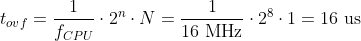
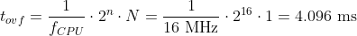
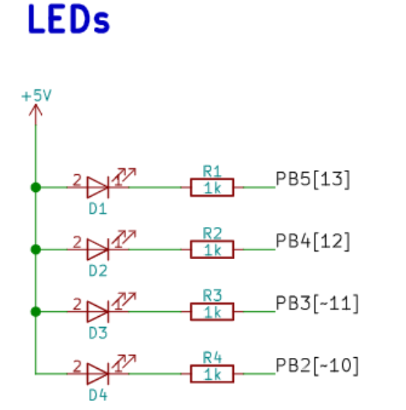
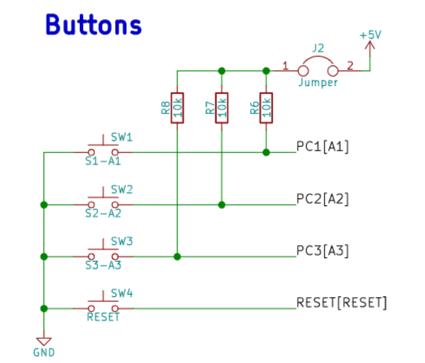
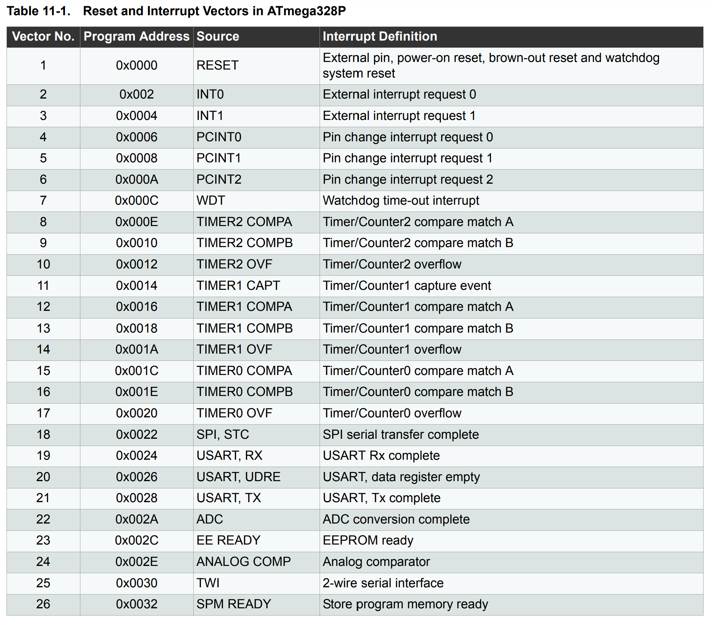
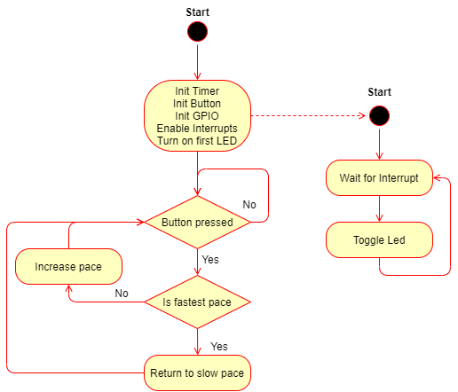
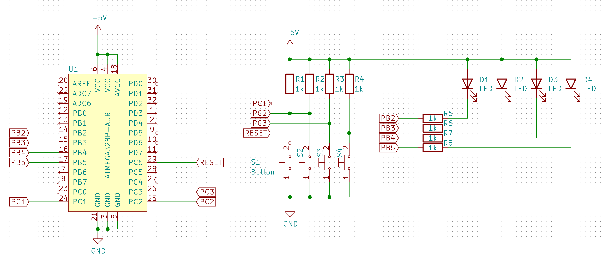
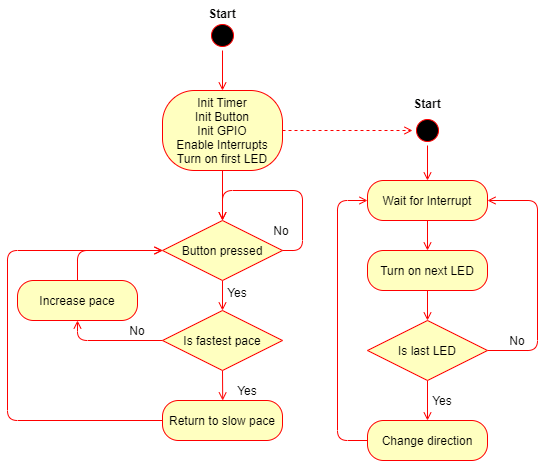

# Lab 4: Gregor Karetka

Link to your `Digital-electronics-2` GitHub repository:

   [https://github.com/gkaretka/Digital-electronics-2](https://github.com/gkaretka/Digital-electronics-2)

## Preparation tasks (done before the lab at home)

Consider an n-bit number that we increment based on the clock signal. If we reach its maximum value and try to increase it, the value will be reset. We call this state an **overflow**. The overflow time depends on the frequency of the clock signal, the number of bits, and on the prescaler value:

##### Calculation for 16 MHz, 8 bit, /1 prescaler

&nbsp;

&nbsp;

##### Calculation for 16 MHz, 16 bit, /1 prescaler

&nbsp;

&nbsp;

### Overflow times

1. Complete table with overflow times.

| **Module** | **Number of bits** | **1** | **8** | **32** | **64** | **128** | **256** | **1024** |
| :-: | :-: | :-: | :-: | :-: | :-: | :-: | :-: | :-: |
| Timer/Counter0 | 8  | 16u | 128u | -- | 1024 us | -- | 4.096 ms | 16.384 ms |
| Timer/Counter1 | 16 | 4.096 ms | 32.768 ms | -- | 262.144 ms | -- | 1.048576 s | 4.194304 s |
| Timer/Counter2 | 8  | 16u | 128u | -- | 1024 us | -- | 4.096 ms | 16.384 ms |

2. Shields are boards that can be attached to an Arduino board, significantly expand its capabilities, and makes prototyping much faster. See schematic of Multi-function shield and find out the connection of four LEDs (D1, D2, D3, D4) and three push buttons (S1-A1, S2-A2, S3-A3).

&nbsp;

&nbsp;

&nbsp;

&nbsp;

## Part 2: Timers

A timer (or counter) is a hardware block within an MCU and can be used to measure time events. ATmega328P has three timers, called:
   * Timer/Counter0,
   * Timer/Counter1, and
   * Timer/Counter2.

T/C0 and T/C2 are 8-bit timers, where T/C1 is a 16-bit timer. The counter counts in synchronization with microcontroller clock from 0 up to 255 (for 8-bit counter) or 65,535 (for 16-bit). Different clock sources can be selected for each timer using a CPU frequency divider with fixed prescaler values, such as 8, 64, 256, 1024, and others.

The timer modules can be configured with several special purpose registers. According to the [ATmega328P datasheet](https://www.microchip.com/wwwproducts/en/ATmega328p) (eg in the **8-bit Timer/Counter0 with PWM > Register Description** section), which I/O registers and which bits configure the timer operations?

| **Module** | **Operation** | **I/O register(s)** | **Bit(s)** |
| :-: | :-- | :-: | :-- |
| Timer/Counter0 | Prescaler<br><br>8-bit data value<br>Overflow interrupt enable | TCCR0B<br><br>TCNT0<br>TIMSK0 | CS02 CS01 CS00<br>(000: stopped, 001: 1, 010: 8, 011: 64, 100: 256, 101: 1024)<br>TCNT0[7:0]<br>TOIE0 (timer enable; 1: enable, 0: disable) |
| Timer/Counter1 | Prescaler<br><br>16-bit data value<br>Overflow interrupt enable | TCCR1B<br><br>TCNT1H, TCNT1L<br>TIMSK1 | CS12, CS11, CS10<br>(000: stopped, 001: 1, 010: 8, 011: 64, 100: 256, 101: 1024)<br>TCNT1[15:0]<br>TOIE1 (1: enable, 0: disable) |
| Timer/Counter2 | Prescaler<br><br>8-bit data value<br>Overflow interrupt enable | TCCR2B<br><br>TCNT2<br>TIMSK2 | CS22 CS21 CS20<br>(000: stopped, 001: 1, 010: 8, 011: 64, 100: 256, 101: 1024)<br>TCNT2[7:0]<br>TOIE2 (timer enable; 1: enable, 0: disable) |

## Part 3: Polling and Interrupts

The state of continuous monitoring of any parameter is called **polling**. The microcontroller keeps checking the status of other devices; and while doing so, it does no other operation and consumes all its processing time for monitoring [[3]](https://www.renesas.com/us/en/support/technical-resources/engineer-school/mcu-programming-peripherals-04-interrupts.html).

Interrupts can be established for events such as a counter's value, a pin changing state, serial communication receiving of information, or the Analog to Digital Converted has finished the conversion process.

See the [ATmega328P datasheet](https://www.microchip.com/wwwproducts/en/ATmega328p) (section **Interrupts > Interrupt Vectors in ATmega328 and ATmega328P**) for sources of interruptions that can occur on ATmega328P. Complete the selected interrupt sources in the following table. The names of the interrupt vectors in C can be found in [C library manual](https://www.nongnu.org/avr-libc/user-manual/group__avr__interrupts.html).




### Timer library

1. In your words, describe the difference between common C function and interrupt service routine.
   * Function - generic block of code we want to reuse. This block can be called from anywhere in our program.
   * Interrupt service routine - function to which we jump when interrupt occures, usually short. Main program is halted and after ISR is executed resumed from the same point it was halted in  

2. Part of the header file listing with syntax highlighting, which defines settings for Timer/Counter0:

```c
/**
 * @name  Definitions of Timer/Counter0
 * @note  F_CPU = 16 MHz
 */
/**
 * @name  Definitions for 8-bit Timer/Counter0
 * @note  t_OVF = 1/F_CPU * prescaler * 2^n where n = 8, F_CPU = 16 MHz
 */
/**
 * @name  Definitions for 8-bit Timer/Counter0
 * @note  t_OVF = 1/F_CPU * prescaler * 2^n where n = 8, F_CPU = 16 MHz
 */
#define TIM0_stop()                         TCCR0B &= ~((1<<CS02) | (1<<CS01) | (1<<CS00));
/** @brief Set overflow 16us, prescaler 001 --> 1 */
#define TIM0_overflow_16us()                TCCR0B &= ~((1<<CS02) | (1<<CS01)); TCCR0B |= (1<<CS00);
/** @brief Set overflow 128us, prescaler 010 --> 8 */
#define TIM0_overflow_128us()               TCCR0B &= ~((1<<CS02) | (1<<CS00)); TCCR0B |= (1<<CS01);
/** @brief Set overflow 1024 us, prescaler 011 --> 64 */
#define TIM0_overflow_1024us()              TCCR0B &= ~(1<<CS02); TCCR0B |= (1<<CS01) | (1<<CS00);
/** @brief Set overflow 4096us, prescaler 100 --> 256 */
#define TIM0_overflow_4096us()              TCCR0B &= ~((1<<CS01) | (1<<CS00)); TCCR0B |= (1<<CS02);
/** @brief Set overflow 16384 us, prescaler // 101 --> 1024 */
#define TIM0_overflow_16384us()             TCCR0B &= ~(1<<CS01); TCCR0B |= (1<<CS02) | (1<<CS00);
/** @brief Enable overflow interrupt, 1 --> enable */
#define TIM0_overflow_interrupt_enable()    TIMSK0 |= (1<<TOIE0);
/** @brief Disable overflow interrupt, 0 --> disable */
#define TIM0_overflow_interrupt_disable()   TIMSK0 &= ~(1<<TOIE0);
```

3. Flowchart figure for function `main()` and interrupt service routine `ISR(TIMER1_OVF_vect)` of application that ensures the flashing of one LED in the timer interruption. When the button is pressed, the blinking is faster, when the button is released, it is slower. Use only a timer overflow and not a delay library.

   

```c
static inline void knight_rider();

/* Function definitions ----------------------------------------------*/
/**********************************************************************
 * Function: Main function where the program execution begins
 * Purpose:  Toggle one LED on the Multi-function shield using 
             the internal 8- or 16-bit Timer/Counter.
 * Returns:  none
 **********************************************************************/
int main(void)
{
    // Configuration of LED(s) at port B - active low
    GPIO_config_output(&DDRB, LED_D1);
    GPIO_write_high(&PORTB, LED_D1); // high
    
    GPIO_config_input_pullup(&DDRC, BUTTON);

    // Configuration of 16-bit Timer/Counter1 for LED blinking
    // Set the overflow prescaler to 262 ms and enable interrupt
    TIM1_overflow_262ms();
    TIM1_overflow_interrupt_enable();

    // Enables interrupts by setting the global interrupt mask
    sei();
    
    enum speed_states {SPEED_4MS = 0, SPEED_33MS = 1, SPEED_262MS = 2, SPEED_1S = 3, SPEED_4S = 4};
    uint8_t speed_state = SPEED_262MS;
    
    // Infinite loop
    while (1)
    {
        /* Empty loop. All subsequent operations are performed exclusively 
         * inside interrupt service routines ISRs */
        
        if (GPIO_read(&PINC, BUTTON) == 0) {
            switch(speed_state) {
                case (SPEED_4S):
                    speed_state = SPEED_1S;
                    TIM1_overflow_1s();
                    break;
                    
                case (SPEED_1S):
                    speed_state = SPEED_262MS;
                    TIM1_overflow_262ms();
                    break;
                
                case (SPEED_262MS):
                    speed_state = SPEED_33MS;
                    TIM1_overflow_33ms();
                    break;
                
                case (SPEED_33MS):
                    speed_state = SPEED_4MS;
                    TIM1_overflow_4ms();
                    break;
                
                case (SPEED_4MS):
                    speed_state = SPEED_4S;
                    TIM1_overflow_4s();
                    break;
                    
                default:
                    speed_state = SPEED_4S;
                    TIM1_overflow_4s();
                    break;
            }
            
            _delay_ms(500);
        }
    }

    // Will never reach this
    return 0;
}

/* Interrupt service routines ----------------------------------------*/
/**********************************************************************
 * Function: Timer/Counter1 overflow interrupt
 * Purpose:  Toggle D1 LED on Multi-function shield.
 **********************************************************************/
ISR(TIMER1_OVF_vect)
{
   GPIO_toggle(&PORTB, LED_D1);
}
```


### Knight Rider

1. Scheme of Knight Rider application with four LEDs and a push button, connected according to Multi-function shield. Connect AVR device, LEDs, resistors, push button, and supply voltage. The image can be drawn on a computer or by hand. Always name all components and their values!

#### Schematic

   

#### Flow diagram 

   
