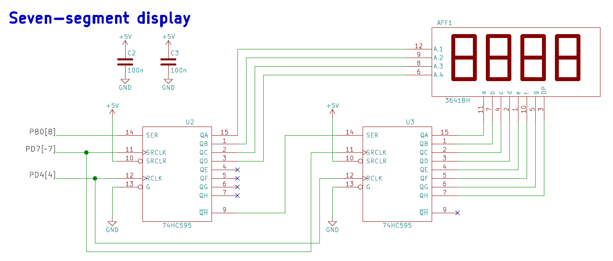

# Lab 5: Display devices, 7-segment display

### Learning objectives

The purpose of the laboratory exercise is to understand the serial control of four seven-segment displays (SSDs) using a pair of 74595 shift registers. In addition, the goal is to master the use of interrupts in applications with AVR.

## Preparation tasks (done before the lab at home)

Read the [7-segment display tutorial](https://www.electronics-tutorials.ws/blog/7-segment-display-tutorial.html) and find out what is the difference between:
   * Common Cathode 7-segment display (CC SSD)
   * Common Anode 7-segment display (CA SSD)

In the following table, write the binary values of the segments for display 0 to 9 on a common anode 7-segment display.

   | **Digit** | **A** | **B** | **C** | **D** | **E** | **F** | **G** | **DP** |
   | :-: | :-: | :-: | :-: | :-: | :-: | :-: | :-: | :-: |
   | 0 | 0 | 0 | 0 | 0 | 0 | 0 | 1 | 1 |
   | 1 | 1 | 0 | 0 | 1 | 1 | 1 | 1 | 1 |
   | 2 | 0 | 0 | 1 | 0 | 0 | 1 | 0 | 1 |
   | 3 | 0 | 0 | 0 | 0 | 1 | 1 | 0 | 1 |
   | 4 | 1 | 0 | 0 | 1 | 1 | 0 | 0 | 1 |
   | 5 | 0 | 1 | 0 | 0 | 1 | 0 | 0 | 1 |
   | 6 | 0 | 1 | 0 | 0 | 0 | 0 | 0 | 1 |
   | 7 | 0 | 0 | 0 | 1 | 1 | 1 | 1 | 1 |
   | 8 | 0 | 0 | 0 | 0 | 0 | 0 | 0 | 1 |
   | 9 | 0 | 0 | 0 | 1 | 1 | 0 | 0 | 1 |

Use schematic of the [Multi-function shield](../../Docs/arduino_shield.pdf) and find out the connection of seven-segment display. What is the purpose of two shift registers 74HC595?

Shift registers are used to easily control devices requiring many input signals that do not need to be controlled fast. This way we need only two pins (input: SER, clock: SRCLK) to control as many pins as we want. This device presents additional reset input(SRCLR) and "output update" (RCLK). This way we can update values and change ouput synchronously. 

We can cascade these devices. In this case we use 3 pins to control both anodes and cathodes of seven segment display.

### Mode of operation

1. Fill all 16 bits bit by bit of data using SER and SRCLK
2. Update outputs using RCLK 

