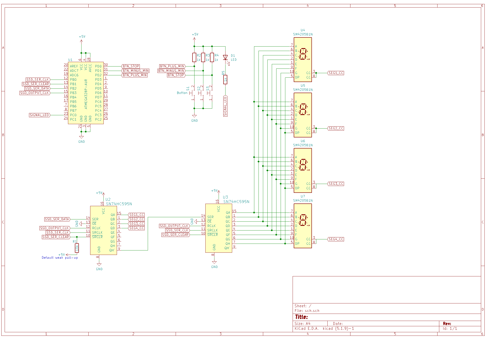

# Lab 5: Gregor Karetka

Link to your `Digital-electronics-2` GitHub repository:

   [https://github.com/gkaretka/Digital-electronics-2](https://github.com/gkaretka/Digital-electronics-2)

### Learning objectives

The purpose of the laboratory exercise is to understand the serial control of four seven-segment displays (SSDs) using a pair of 74595 shift registers. In addition, the goal is to master the use of interrupts in applications with AVR.

## Preparation tasks (done before the lab at home)

Read the [7-segment display tutorial](https://www.electronics-tutorials.ws/blog/7-segment-display-tutorial.html) and find out what is the difference between:
   * Common Cathode 7-segment display (CC SSD)
   * Common Anode 7-segment display (CA SSD)

In the following table, write the binary values of the segments for display 0 to 9 on a common anode 7-segment display.

   | **Digit** | **A** | **B** | **C** | **D** | **E** | **F** | **G** | **DP** |
   | :-: | :-: | :-: | :-: | :-: | :-: | :-: | :-: | :-: |
   | 0 | 0 | 0 | 0 | 0 | 0 | 0 | 1 | 1 |
   | 1 | 1 | 0 | 0 | 1 | 1 | 1 | 1 | 1 |
   | 2 | 0 | 0 | 1 | 0 | 0 | 1 | 0 | 1 |
   | 3 | 0 | 0 | 0 | 0 | 1 | 1 | 0 | 1 |
   | 4 | 1 | 0 | 0 | 1 | 1 | 0 | 0 | 1 |
   | 5 | 0 | 1 | 0 | 0 | 1 | 0 | 0 | 1 |
   | 6 | 0 | 1 | 0 | 0 | 0 | 0 | 0 | 1 |
   | 7 | 0 | 0 | 0 | 1 | 1 | 1 | 1 | 1 |
   | 8 | 0 | 0 | 0 | 0 | 0 | 0 | 0 | 1 |
   | 9 | 0 | 0 | 0 | 1 | 1 | 0 | 0 | 1 |

Use schematic of the [Multi-function shield](../../Docs/arduino_shield.pdf) and find out the connection of seven-segment display. What is the purpose of two shift registers 74HC595?

Shift registers are used to easily control devices requiring many input signals that do not need to be controlled fast. This way we need only two pins (input: SER, clock: SRCLK) to control as many pins as we want. This device presents additional reset input(SRCLR) and "output update" (RCLK). This way we can update values and change ouput synchronously. 

We can cascade these devices. In this case we use 3 pins to control both anodes and cathodes of seven segment display.

### Mode of operation

1. Fill all 16 bits bit by bit of data using SER and SRCLK
2. Update outputs using RCLK 


## Assignment

### 7-segment library

1. In your words, describe the difference between Common Cathode and Common Anode 7-segment display.
   * CC SSD - common catode, display is selected by aplying negative voltage at anode and segments are selected by aplying positive voltage at ports (A,B, .. G, DP).
   * CA SSD - common anode, display is selected by aplying positive voltage at anode and segments are selected by aplying negative voltage at ports (A,B, .. G, DP).  

2. Code listing with syntax highlighting of two interrupt service routines (`TIMER1_OVF_vect`, `TIMER0_OVF_vect`) from counter application with at least two digits, ie. values from 00 to 59:

```c
/**********************************************************************
 * Function: Timer/Counter1 overflow interrupt, running at couinting frequency
 * Purpose:  Increment counter value from 00 to 9999.
 **********************************************************************/
ISR(TIMER1_OVF_vect)
{
    val++;
    if (val == 9999) val = 0;
}
```

```c
/**********************************************************************
 * Function: Timer/Counter0 overflow interrupt, running at switching frequency
 * Purpose:  Display tens and units of a counter at SSD.
 **********************************************************************/

ISR(TIMER0_OVF_vect)
{
    static uint8_t pos = 0;
    // precalculated powers of 10
    static int pow10[5] = { 1, 10, 100, 1000, 10000 };
    
    // calculate digit from number and pos
    uint16_t loc_val = (val % pow10[pos+1]) / (pow10[pos]);
    
    // Update segment
    SEG_update_shift_regs(loc_val, pos);
    
    // Increment to go to next position
    pos++;
    if (pos == 4) pos = 0; // If position exceeded go to first position
}
```

3. Flowchart figure for function `SEG_clk_2us()` which generates one clock period on `SEG_CLK` pin with a duration of 2&nbsp;us. The image can be drawn on a computer or by hand. Use clear descriptions of the individual steps of the algorithms.

   


### Kitchen alarm

Consider a kitchen alarm with a 7-segment display, one LED and three push buttons: start, +1 minute, -1 minute. Use the +1/-1 minute buttons to increment/decrement the timer value. After pressing the Start button, the countdown starts. The countdown value is shown on the display in the form of mm.ss (minutes.seconds). At the end of the countdown, the LED will start blinking.

1. Scheme of kitchen alarm; do not forget the supply voltage. The image can be drawn on a computer or by hand. Always name all components and their values.

   