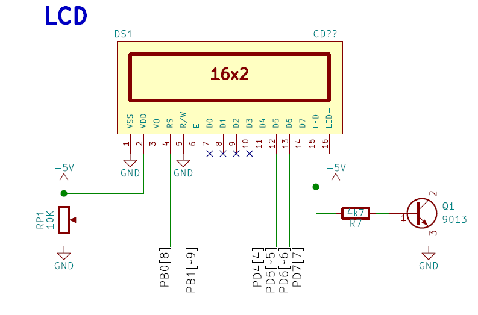
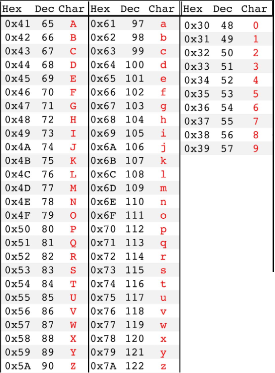
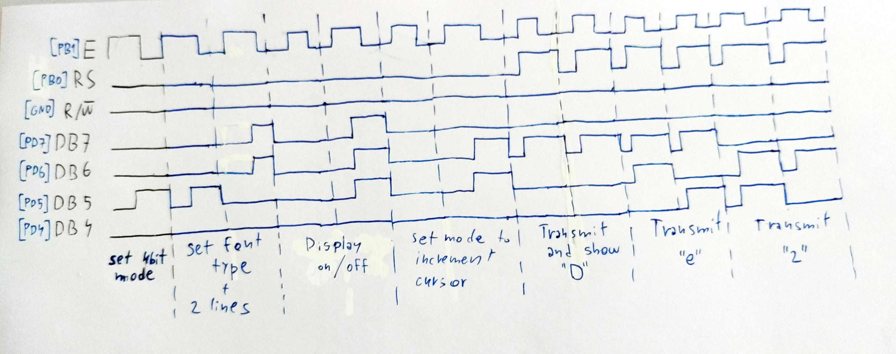

# Lab 6: Gregor Karetka

Link to your `Digital-electronics-2` GitHub repository:

   [https://github.com/gkaretka/Digital-electronics-2](https://github.com/gkaretka/Digital-electronics-2)

# Lab 6: Display devices, LCD display

### Learning objectives

After completing this lab you will be able to:
   * Use text-based LCD
   * Understand the digital communication between MCU and HD44780
   * Use library functions for LCD
   * Generate custom characters on LCD

The purpose of the laboratory exercise is to understand the serial control of Hitachi HD44780-based LCD character display and how to define custom characters. Another goal is to learn how to read documentation for library functions and use them in your own project.

<a name="preparation"></a>
## Preparation tasks (done before the lab at home)

Use schematic of the [LCD keypad shield](../../Docs/arduino_shield.pdf) and find out the connection of LCD display. What data and control signals are used? What is the meaning of these signals?



   | **LCD signal(s)** | **AVR pin(s)** | **Description** |
   | :-: | :-: | :-- |
   | RS | PB0 | Register selection signal. Selection between Instruction register (RS=0) and Data register (RS=1) |
   | R/W | GND | Read/write (active low) selector |
   | E | PB1 | Enable: Starts data read/write |
   | D[3:0] | N/C (we use 4-bit mode) |  Four low order bidirectional tristate data bus pins. Used for data transfer and receive between the MPU and the HD44780U. These pins are not used during 4-bit operation |
   | D[7:4] | PD4, PD5, PD6, PD7 |  Four high order bidirectional tristate data bus pins. Used for data transfer and receive between the MPU and the HD44780U. DB7 can be used as a busy flag. |

What is the ASCII table? What are the codes/values for uppercase letters `A` to `Z`, lowercase letters `a` to `z`, and numbers `0` to `9` in this table?

   

### LCD display module

1. In your words, describe what ASCII table is.
   * ASCII - is table that defines number value for standard characters (letters, numbers, control characters like new line/delete etc.)

2. (Hand-drawn) picture of time signals between ATmega328P and LCD keypad shield (HD44780 driver) when transmitting three character data `De2`.

   


### Stopwatch

1. Flowchart figure for `TIMER2_OVF_vect` interrupt service routine which overflows every 16&nbsp;ms but it updates the stopwatch LCD approximately every 100&nbsp;ms (6 x 16&nbsp;ms = 100&nbsp;ms). Display tenths of a second and seconds `00:seconds.tenths`. Let the stopwatch counts from `00:00.0` to `00:59.9` and then starts again. The image can be drawn on a computer or by hand. Use clear descriptions of the individual steps of the algorithms.

   


### Custom characters

1. Code listing with syntax highlighting of two custom character definition:

```c
/* Variables ---------------------------------------------------------*/
// Custom character definition
uint8_t customChar[16] = {
    // WRITE YOUR CODE HERE

};
```


### Kitchen alarm

Consider a kitchen alarm with an LCD, one LED and three push buttons: start, +1 minute, -1 minute. Use the +1/-1 minute buttons to increment/decrement the timer value. After pressing the Start button, the countdown starts. The countdown value is shown on the display in the form of mm.ss (minutes.seconds). At the end of the countdown, the LED will start blinking.

1. Scheme of kitchen alarm; do not forget the supply voltage. The image can be drawn on a computer or by hand. Always name all components and their values.

   