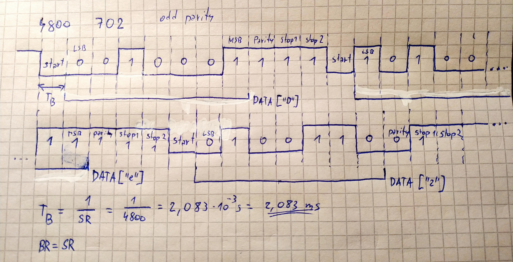
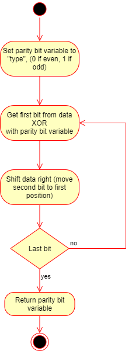
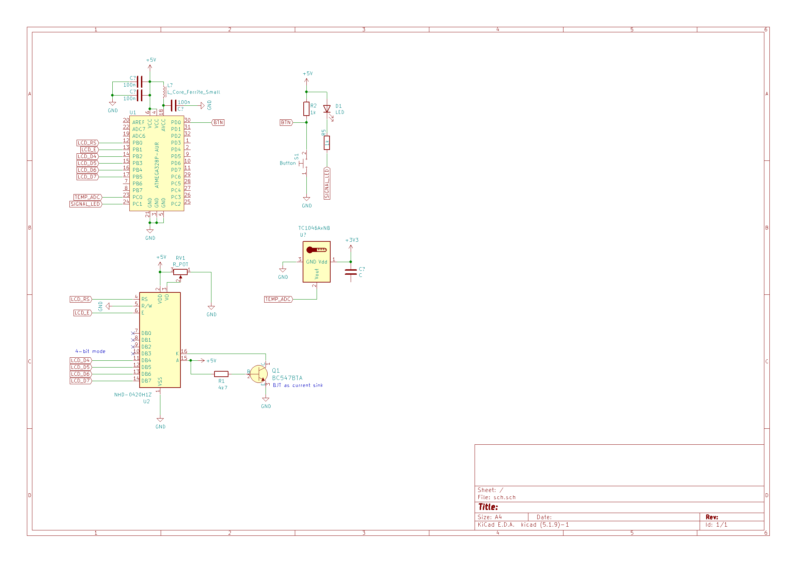

# Lab 7: Gregor Karetka

Link to your `Digital-electronics-2` GitHub repository:

   [https://github.com/gkaretka/Digital-electronics-2](https://github.com/gkaretka/Digital-electronics-2)

# Lab 7: ADC and UART serial communication

## Preparation tasks (done before the lab at home)

1. Use schematic of the LCD keypad shield and find out the connection of five push buttons: Select, Left, Up, Down, and Right.


2. According to the connection, calculate the voltage values on pin PC0[A0] if one button is pressed at each time. In this case, the voltage on the pin is given by the [voltage divider](https://www.allaboutcircuits.com/tools/voltage-divider-calculator/), where resistors R3, R4, R5 and R6 are applied successively.


1. Calculate the ADC values for these voltages according to the following equation if reference is Vref=5V and number of bits for analog to digital conversion is n=10.

   

   | **Push button** | **PC0[A0] voltage** | **ADC value (calculated)** | **ADC value (measured)** |
   | :-: | :-: | :-: | :-: |
   | Right  | 0&nbsp;V | 0 | todo |
   | Up     | 0.495&nbsp;V | 101 | todo |
   | Down   | 1.203&nbsp;V | 246 | todo |
   | Left   | 1.970&nbsp;V | 403 | todo |
   | Select | 3.182&nbsp;V | 651 | todo |
   | none   | 5&nbsp;V | 1023 | todo |

The operation with the AD converter is performed through ADMUX, ADCSRA, ADCL+ADCH, ADCSRB, and DIDR0 registers. See [ATmega328P datasheet](https://www.microchip.com/wwwproducts/en/ATmega328p) (**Analog-to-Digital Converter > Register Description**) and complete the following table.

   | **Operation** | **Register(s)** | **Bit(s)** | **Description** |
   | :-- | :-: | :-: | :-- |
   | Voltage reference    | ADMUX | REFS1:0 | 01: AVcc voltage reference (5V), ... |
   | Input channel        | ADMUX | MUX3:0 | 0000: ADC0, 0001: ADC1, ... |
   | ADC enable           | ADCSRA | ADEN | 1: ADC Enable, 0: ADC Disabled |
   | Start conversion     | ADCSRA | ADSC | 1: Start first conversion/start conversion, 0: stop conversion |
   | ADC interrupt enable | ADCSRA | ADIE | 1: Enable interrupt, 0: Disable interrupt |
   | ADC clock prescaler  | ADCSRA | ADPS2:0 | 000: Division factor 2, 001: 2, 010: 4, ...|
   | ADC 10-bit result    | ADMUX | ADLAR | 0: 10-bit mode(ADCH:L), 1: 8-bit mode(values stored only in ADCH) |

In the lab, we are using [UART library](http://www.peterfleury.epizy.com/avr-software.html) developed by Peter Fleury. Use online manual of UART library and add the input parameters and description of the functions to the following table.


   | **Function name** | **Function parameter(s)** | **Description** | **Example** |
   | :-- | :-- | :-- | :-- |
   | `uart_init` | `UART_BAUD_SELECT(9600, F_CPU)` | Initialize UART to 8N1 and set baudrate to 9600&nbsp;Bd | `uart_init(UART_BAUD_SELECT(9600, F_CPU));` |
   | `uart_getc` | `void` | Get received byte from ringbuffer. | `uint8_t c = uart_getc();`
   | `uart_putc` | `unsigned char data` | Put byte to ringbuffer for transmitting via UART. | `uart_putc('c');`
   | `uart_puts` | `const char *s` | Put string to ringbuffer for transmitting via UART. | `uart_puts("msg");`

Code listing of ACD interrupt service routine for sending data to the LCD/UART and identification of the pressed button. Always use syntax highlighting and meaningful comments:

```c
/**********************************************************************
 * Function: ADC complete interrupt
 * Purpose:  Display value on LCD and send it to UART.
 **********************************************************************/
ISR(ADC_vect)
{
    uint16_t value = 0;
    char lcd_string[4] = "0000";
    value = ADC;                  // Copy ADC result to 16-bit variable
    
    // Clear display and convert to deca (and show)
    lcd_gotoxy(8, 0);
    lcd_puts("    ");
    itoa(value, lcd_string, 10);  // Convert decimal value to string
    lcd_gotoxy(8, 0);
    lcd_puts(lcd_string);
    
    // UART: " value: xxxx "
    uart_puts("\033[4;32m");
    uart_puts(" value: ");
    uart_puts(lcd_string);
    uart_puts(" ");
    
    // Clear display and display hexa value
    lcd_gotoxy(13, 0);
    lcd_puts("    ");
    itoa(value, lcd_string, 16);  // Convert decimal value to string
    lcd_gotoxy(13, 0);
    lcd_puts(lcd_string);
    
    // hexa string + newline
    uart_puts(lcd_string);
    uart_puts("\r\n   key: ");
    
    // clear key display
    lcd_gotoxy(8, 1);
    lcd_puts("      ");
    
    // Display key on LCD and serial 
    lcd_gotoxy(8, 1);
    if (value < 75) {
        lcd_puts("Right");
        uart_puts("Right");
    } else if (value < 150) {
        lcd_puts("Up");
        uart_puts("Up");
    } else if (value < 350) {
        lcd_puts("Down");
        uart_puts("Down");
    } else if (value < 550) {
        lcd_puts("Left");
        uart_puts("Left");
    } else if (value < 800) {
        lcd_puts("Select");
        uart_puts("Select");
    } else {
        lcd_puts("None");
        uart_puts("None");
    }
    
    // UART 2xnewlines
    uart_puts("\r\n\r\n");
}
```
### UART communication

1. (Hand-drawn) picture of UART signal when transmitting three character data `De2` in 4800 7O2 mode (7 data bits, odd parity, 2 stop bits, 4800&nbsp;Bd).

   

2. Flowchart figure for function `uint8_t get_parity(uint8_t data, uint8_t type)` which calculates a parity bit of input 8-bit `data` according to parameter `type`. The image can be drawn on a computer or by hand. Use clear descriptions of the individual steps of the algorithms.

   

### C code for `uint8_t get_parity(uint8_t data, uint8_t type)`

```c
uint8_t get_parity(uint8_t data, uint8_t type)
{
    uint8_t pbl = type;

    for (int8_t i = 0; i < 8; i++) {
        pbl = (data & 1 ) ^ pbl;
        data >>= 1;
    }

    return pbl;
}
```

### Temperature meter

Consider an application for temperature measurement and display. Use temperature sensor [TC1046](http://ww1.microchip.com/downloads/en/DeviceDoc/21496C.pdf), LCD, one LED and a push button. After pressing the button, the temperature is measured, its value is displayed on the LCD and data is sent to the UART. When the temperature is too high, the LED will start blinking.

1. Scheme of temperature meter. The image can be drawn on a computer or by hand. Always name all components and their values.

