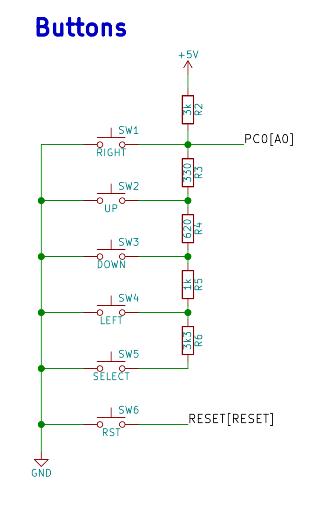

# Lab 7: Gregor Karetka

Link to your `Digital-electronics-2` GitHub repository:

   [https://github.com/gkaretka/Digital-electronics-2](https://github.com/gkaretka/Digital-electronics-2)

# Lab 7: ADC and UART serial communication

## Preparation tasks (done before the lab at home)

1. Use schematic of the LCD keypad shield and find out the connection of five push buttons: Select, Left, Up, Down, and Right.

2. According to the connection, calculate the voltage values on pin PC0[A0] if one button is pressed at each time. In this case, the voltage on the pin is given by the [voltage divider](https://www.allaboutcircuits.com/tools/voltage-divider-calculator/), where resistors R3, R4, R5 and R6 are applied successively.

1. Calculate the ADC values for these voltages according to the following equation if reference is Vref=5V and number of bits for analog to digital conversion is n=10.

   

   | **Push button** | **PC0[A0] voltage** | **ADC value (calculated)** | **ADC value (measured)** |
   | :-: | :-: | :-: | :-: |
   | Right  | 0&nbsp;V | 0 | todo |
   | Up     | 0.495&nbsp;V | 101 | todo |
   | Down   | 1.203&nbsp;V | 246 | todo |
   | Left   | 1.970&nbsp;V | 403 | todo |
   | Select | 3.182&nbsp;V | 651 | todo |
   | none   | 5&nbsp;V | 1023 | todo |